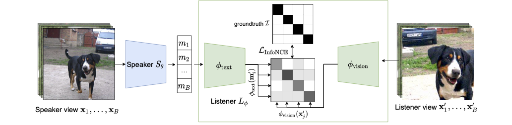

# PatchGame: Learning to SignalMid-level Patches in Referential Games

This repository is the official implementation of the paper - "PatchGame: Learning to SignalMid-level Patches in Referential Games" 



## Requirements

We recommend using `anaconda` or `miniconda` for python. Our code has been tested with `python=3.6` on linux.

To create a new environment with conda

```
conda create -n patchgame python=3.8
conda activate patchgame
```

We recommend installing the latest pytorch and torchvision packages
You can install them using 

```
conda install pytorch torchvision -c pytorch
``` 
Make sure the following requirements are met

* torch>=1.8.1
* torchvision>=0.9.1


### Installing `torchsort`

Note we only tried installing torchsort with following `cuda==10.2.89` and `gcc==6.3.0`.

```
export TORCH_CUDA_ARCH_LIST="Pascal;Volta;Turing"
unzip torchsort.zip && cd torchsort
python setup.py install --user
cd .. && rm -rf torchsort
```

## Dataset
We use [ImageNet-1k](https://www.image-net.org/) (ILSVRC2012) data in all our experiments. Please download and save the data from the official website.

## Training

To train the model(s) in the paper on 1-8 GPUs, run this command (where `nproc_per_node` is the number of gpus):

```train
python -m torch.distributed.launch --nproc_per_node=1 train.py \
    --data_path /patch/to/imagenet/dir/train \
    --output_dir /path/to/checkpoint/dir \
    --patch_size 32 --epochs 100
```

## Evaluation

To evaluate my model on ImageNet, run:

```eval
python eval.py --model-file mymodel.pth --benchmark imagenet
```

## Pre-trained Models

You can download pretrained models here:

- [My awesome model](https://drive.google.com/mymodel.pth) trained on ImageNet using parameters x,y,z. 


## Results

Our model achieves the following performance on :

### [Image Classification on ImageNet](https://paperswithcode.com/sota/image-classification-on-imagenet)

| Model name         | Top 1 Accuracy  | Top 5 Accuracy |
| ------------------ |---------------- | -------------- |
| My awesome model   |     85%         |      95%       |


## Acknowledgements

We would like to thank several public repos from where we borrowed various utilities
- https://github.com/facebookresearch/detr,
- https://github.com/facebookresearch/deit,
- https://github.com/facebookresearch/barlowtwins
- https://github.com/rwightman/pytorch-image-models

## License
This repository is released under the Apache 2.0 license as found in the [LICENSE](LICENSE) file.